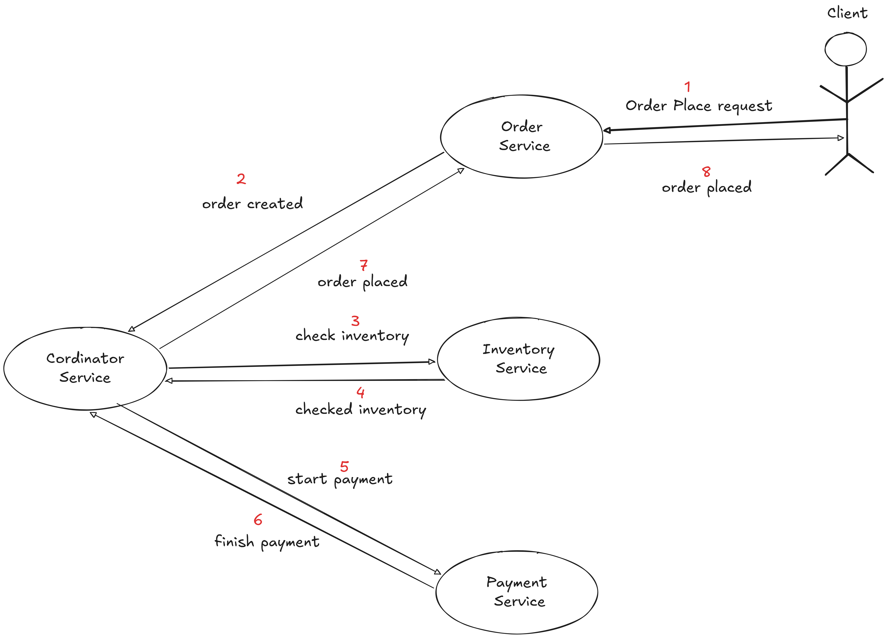
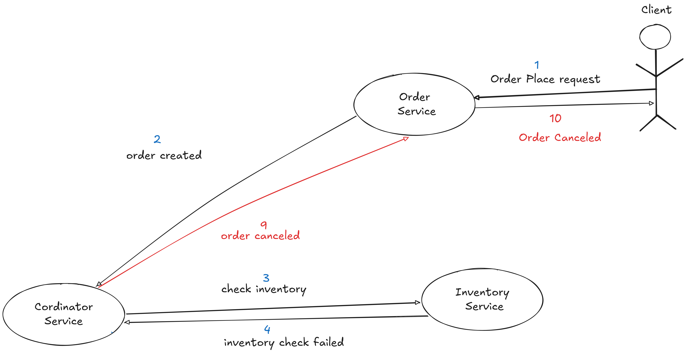
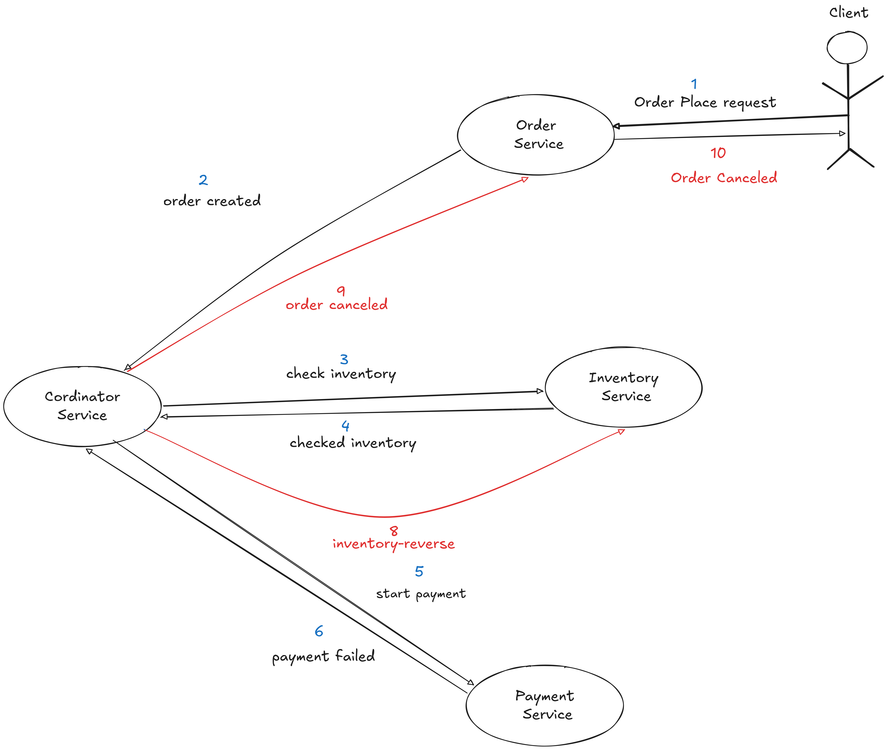

#  Project Documentation: Saga & Outbox System

###  Navigation
* [1. Architectural Design](#architectural-design)
* [2. Saga Pattern Flows](#saga-pattern-flows)
    * [2.1 Happy Path Sequence](#happy-path-sequence)
    * [2.2 Inventory Failure](#inventory-failure)
    * [2.3 Payment Failure](#payment-failure)
* [3. Project Summary](#project-summary)

---

## 1. Architectural Design

<b>Click to view Architecture Details</b>

 

The system is built on a **Microservices Architecture** utilizing the **Orchestration-based Saga Pattern** coupled with the **Transactional Outbox Pattern**.

* **Reliability Layer:** **Transactional Outbox Table** ensures atomic database updates and message publishing.
* **Messaging Engine:** Apache Kafka 4.0.1 (KRaft mode).
* **Observability:** Structured JSON logging via `LogstashEncoder` for centralized ELK monitoring.

---

## 2. Saga Pattern Flows

The Saga Orchestrator coordinates distributed transactions. If any step fails, the Coordinator triggers **Compensating Transactions**.

 

<h3>2.1 Happy Path Sequence (Click to expand)</h3>

 

1. **Order Place Request:** Client sends request to **Order Service**.
2. **Order Created:** **Order Service** notifies **Coordinator**.
3. **Check Inventory:** **Coordinator** requests stock.
4. **Checked Inventory:** **Inventory Service** confirms availability.
5. **Start Payment:** **Coordinator** triggers **Payment Service**.
6. **Finish Payment:** **Payment Service** confirms success.
7. **Order Placed (Internal):** **Coordinator** finalizes state.
8. **Order Placed (Client):** **Order Service** confirms success to Client.

<h3>2.2 Inventory Failure (Click to expand)</h3>

 

1. **Steps 1-3:** Proceed as normal.
2. **Inventory Check Failed (Step 4):** **Inventory Service** notifies **Coordinator** of insufficient stock.
3. **Order Canceled (Step 9):** **Coordinator** sends cancellation to **Order Service**.
4. **Order Canceled (Step 10):** **Order Service** notifies the **Client**.

<h3>2.3 Payment Failure (Click to expand)</h3>

 

1. **Steps 1-5:** Proceed through Order Creation and Inventory Reservation.
2. **Payment Failed (Step 6):** **Payment Service** notifies **Coordinator**.
3. **Inventory-Reverse (Step 8):** **Coordinator** commands **Inventory Service** to release stock.
4. **Order Canceled (Step 9):** **Coordinator** updates **Order Service** status.

---

## 3. Project Summary

<b>Click to view Summary and Core Objectives</b>

###  Core Objective
The primary goal is to implement a **resilient, distributed E-commerce ecosystem** handling transactions across microservices without high-latency global locks.

###  Reliability via Transactional Outbox
We write the business state and the outgoing Kafka event into the same local database in a single atomic transaction. A **Relay Task** ensures "At-Least-Once Delivery."

###  Coordination via Orchestrated Saga
The **Coordinator Service** manages the "State Machine":
* **Decoupling:** Services talk only to the Coordinator.
* **Failure Handling:** Coordinator triggers "Compensating Transactions" (e.g., releasing inventory) on failure.

### 📊 Monitoring & Traceability
Using `LogstashEncoder`, every event is tagged with a `correlationId`, making it visible in the **ELK Stack (Kibana)**.

